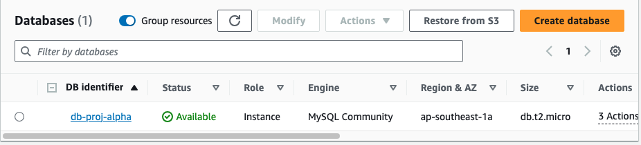
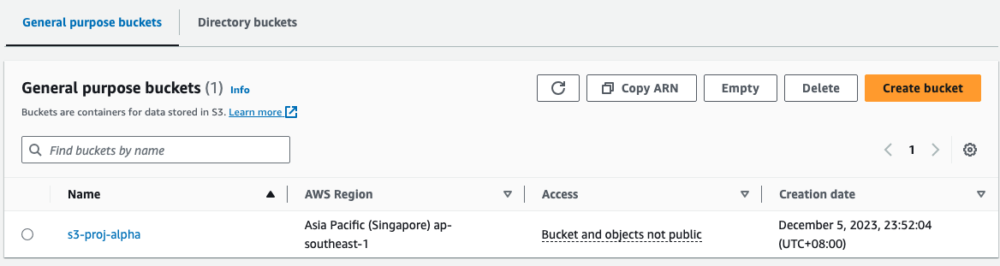

# Terraform Assignment

## Scenario 1
Product Alpha requires the following AWS (or other equivalent clouds) resources to be set up:
- AWS S3 bucket
    - Bucket name: s3_proj_alpha
- AWS RDS instance
    - Instance name: db_proj_alpha
      
Product Beta also requires the following AWS (or other equivalent clouds) resources to be set
up:
- AWS S3 bucket
    - Bucket name: s3_proj_beta
- AWS RDS instance
    - Instance name: db_proj_beta
 
### Requirements
You will also need to set up the resources according to existing hardening guidelines:

Best Practices for creating S3 buckets
1. Server-side encryption must be enabled.
2. Bucket policies only allow HTTPS requests.
3. Bucket must block public access.
4. Bucket versioning must be enabled.
   
Best Practices for creating RDS Instances
1. Master password for the database must be randomly generated.
2. Backups must be enabled and retained for 7 days.
3. Delete protection must be enabled.
4. Minor engine upgrades will be applied automatically to the DB instance.
5. Instance must not be publicly accessible.
   
### Directory Structure
```css
terraform/
├── dev
    └── alpha/
        ├── main.tf
        ├── variables.tf
        ├── provider.tf
        ├── backend.tf
        ├── terraform.tfvars
        └── s3_policy.json
    ├── beta/
        └── beta/
        ├── main.tf
        ├── variables.tf
        ├── provider.tf
        ├── backend.tf
        ├── terraform.tfvars
        └── s3_policy.json
├── modules/
    └── rds/
        ├── main.tf
        └── variables.t
    └── s3/
        ├── main.tf
        └── variables.t
```
The above directory structure consist of a common child module hosted under `modules/rds/` and `modules/s3/`.

Assuming only a single environment is required(dev), the parent modules are split into 2 folders named after the product teams - alpha and beta. 

The child module is called and the input variables are passed using terraform.tfvars in the respective team's folder. This allows logical seperation of resources between teams and the statefiles are managed seperately.

As the individual product team resources types and aws services grow, folders could be further created in the `/dev/<product>` to seperate different components(networking, compute) 

As the project grows with different environments, more folders such as prod or stage could be created. Alternatively, terraform workspace could be utilized for different environments.

### Assumptions
- region is ap-southeast-1 
- 1 working environment - dev
- As per best practice, remote backend in S3 is configured under `providers.tf`, however code is being developed locally for testing purposes
- VPC and subnets are setup, minimally in 1 region with 2 azs

### Quickstart
To create resources

```bash
cd dev/<product-team>/
terraform init
# May require additional information such as aws credentials
terraform plan
# Applying plan
terraform apply 
```
To destroy resources
```bash
cd dev/<product-team>/
terraform init
terraform destroy
```
Note: additional configurations are located in terraform.tfvars. For e.g. to spin up more than 1 rds instances 

### Verify that the resources are in place in aws platform
#### rds

#### S3



## Scenario 2
You need to create IAM users for these newly joined developers of Product Alpha, Beta and Gamma.
This is the list of users to be created, along with their roles and products they are working on:


Requirements

1. Each IAM user must be tagged with information of their role and the product team(s)
they are in.
2. Each IAM user must be associated with a user group.
3. Each user group will be attached to distinct permission policies that would allow them to access resources associated with the product they are working on.

### Directory Structure:
```css
terraform/
├── dev
    ├── common/
        └── iam/
            ├── main.tf
            ├── variables.tf
            ├── provider.tf
            ├── backend.tf
            └── terraform.tfvars

├── modules/
    ├── iam_users/
        ├── main.tf
        └── variables.tf
    
```
The above directory structure consist of a common child module hosted under `modules/iam_users/`. Assuming only a single environment is required(dev), the child module is called and the input variables are passed using terraform.tfvars. 

The parent module is hosted under `dev/common/iam/` which includes the storing of its remote statefile and terraform.tfvars. This allows logical seperation of the IAM related resources which is common amongst all team. 

This structure allows the flexibility of the cloud administrator to add new iam users to specific group, role, and products with ease. An example is shown at the bottom.

### Assumptions
- Both developers and QA roles requires identical permissions to access resources corresponding to their respective products – Alpha, Beta, and Gamma. The IAM group names also align with the product teams’ team for easy reference
- 1 environment - dev
- As per best practice, remote backend in S3 is configured under `providers.tf`, however code is being developed locally for now
- Permission policies attached to the user groups based on the product team or the products they are working on(for e.g. iam users working on product alpha would be placed in iam group `Alpha`). This is aligned with AWS IAM best practices.

### Quickstart
To create resources

```bash
cd dev/common/iam/
terraform init
# May require additional information such as aws credentials
terraform plan
# Applying plan
terraform apply 
```
To destroy resources
```bash
cd dev/common/iam/
terraform init
terraform destroy
```

### To add new users
- Update terraform.tfvars in dev/common/iam as below
```hcl
users = [
  { name = "Alice", role = "Developer", products = ["Alpha", "Gamma"] },
  { name = "Bob", role = "QA", products = ["Beta"] },
  { name = "Michael", role = "Developer", products = ["Beta"] },
  { name = "Mike", role = "QA", products = ["Beta", "Gamma"] },
  { name = "Terry", role = "Developer", products = ["Gamma"] },
  { name = "John", role = "QA", products = ["Alpha"] },
   ## add new user(s) here
  { name = "Tester", role = "QA", products = ["Alpha"] }
]

groups = ["Alpha", "Beta", "Gamma"]
```
### Verify that the groups, permissions, users are in place in aws platform after making changes


